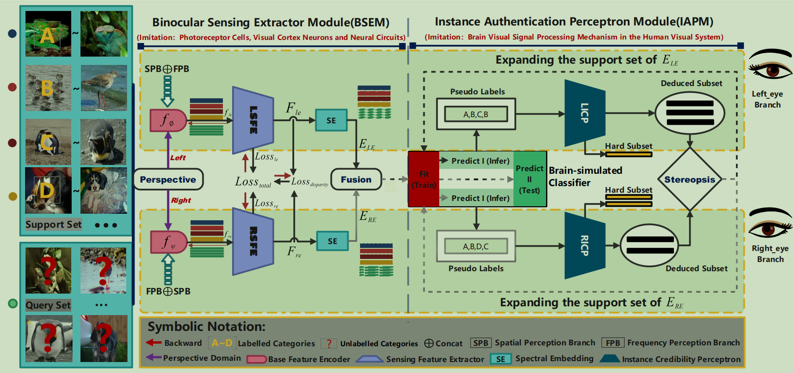
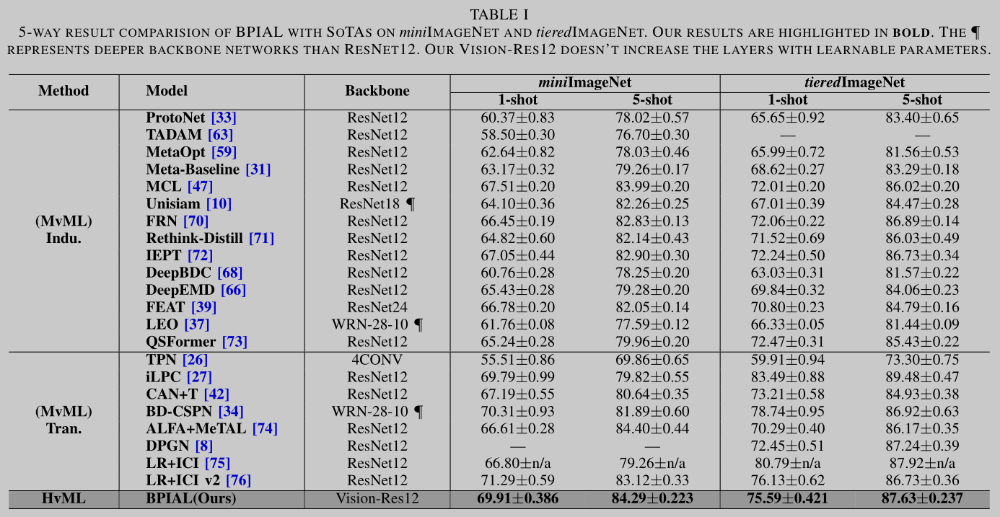
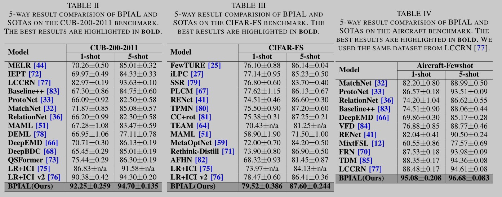
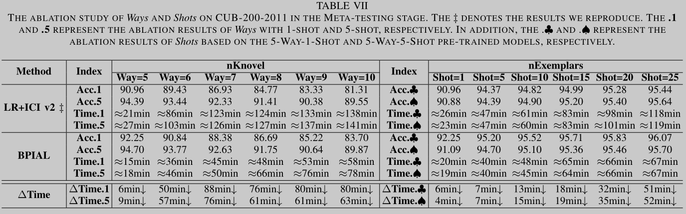
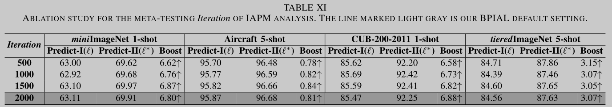

# Binocular Perception Instance Authentication Learning for Few-Shot Visual Recognition

This repository contains the code for our paper "Binocular Perception Instance Authentication Learning for Few-Shot Visual Recognition". 
<p align="center">

</p>


## Requirements
```
python=3.7.6
torch=1.5.1
sklearn=0.23.2
glmnet-py=0.1.0b2
tqdm
```

## 1. Download and Install Apex:
```
git clone https://github.com/NVIDIA/apex  # 22.04-dev
cd apex-22.04-dev
#For Ubuntu:  python3 setup.py install
#For windows:  python setup.py install   
```

## 2. Benchmark Preparation

You can download the dataset from [CIFAR-FS](https://github.com/bertinetto/r2d2), [CUB](http://www.vision.caltech.edu/visipedia/CUB-200-2011.html), [Aircraft-fewshot](https://github.com/lutsong/LCCRN), [miniImageNet](https://github.com/ZZQzzq/BML), and [tieredImageNet](https://github.com/yaoyao-liu/meta-transfer-learning), respectively.
Or you can use your own dataset and modify the corresponding Python file in *data/sets/*.

Please note that our experiments on CUB using the images *cropped* by the provided bounding box  are the same as [ICI v2](https://github.com/Yikai-Wang/ICI-FSL).


## 3. Meta-Training Phase

### Pretrained Models
```
Pretrained models are in the folder *ckpt*.
```

If you want to train the feature extractor from scratch, you should first check the data related hyper-parameters in *config.py*.

Then, to train the feature extractor in 5-way-1-shot task of Benchmark you should run:
```
GPU_IDs='0,1'
DATASET='CIFARFS'
WEIGHTS='1-1-1'
date=`date +"%Y-%m-%d"`
date_time=`date +"%Y-%m-%d-%H:%M"`
MODEL_SAVE_1='ckpt/'$date'/'$DATASET'_'visionres12'_'Weights:$WEIGHTS'/1-shot'
MODEL_SAVE_5='ckpt/'$date'/'$DATASET'_'visionres12'_'Weights:$WEIGHTS'/5-shot'
```
```
python main.py --dataset $DATASET -g $GPU_IDs --nKnovel 5 --nExemplars 1 --phase val --mode train  --save-dir $MODEL_SAVE_1   # 1 shot
```
If you want to train on 5-shot task, using the option:
```
--nExemplars 5
```

## 4. Meta-Testing Phase

If you want to test on the FSL setting, run:

```
GPU_IDs='0'
DATASET='CIFARFS'
WEIGHTS='1-1-1'

date=`date +"%Y-%m-%d"`
date_time=`date +"%Y-%m-%d-%H:%M"`
MODEL_SAVE_1='ckpt/'$date'/'$DATASET'_'visionres12'_'Weights:$WEIGHTS'/1-shot'
MODEL_SAVE_5='ckpt/'$date'/'$DATASET'_'visionres12'_'Weights:$WEIGHTS'/5-shot'
MODEL_PATH_1='ckpt/'$date'/'$DATASET'_'visionres12'_'Weights:$WEIGHTS'/1-shot/best_model.pth.tar'
MODEL_PATH_5='ckpt/'$date'/'$DATASET'_'visionres12'_'Weights:$WEIGHTS'/5-shot/best_model.pth.tar'
SAVE_PATH_1_0='ckpt/'$date'/'$DATASET'_'visionres12'_'Weights:$WEIGHTS'/1-shot/test_1shot/'$date_time''
```

```
python main.py --dataset $DATASET -g $GPU_IDs --nKnovel 5 --nExemplars 1 --phase test --mode test  --resume $MODEL_PATH_1 --save-dir $SAVE_PATH_1_0  # 1 shot
```
If you want to test on 5-shot task, using the option:
```
--nExemplars 5
```

For other options, please check *config.py*.


## 5. Our Experimental Results

<p align="center">

</p>
<p align="center">

</p>
<p align="center">

</p>
<p align="center">

</p>


## Acknowledgments

Our code refers the corresponding code publicly available:  [ICI](https://github.com/Yikai-Wang/ICI-FSL).


## Citation

If you found the provided code useful, please cite our work.
<!--
```
@InProceedings{Chaofei_2024_TMM,
    author    = {Chaofei Qi, Chao Ye, Weiyang Lin, Jianbin Qiu, Huijun Gao},
    title     = {Binocular Perception Instance Authentication Learning for Few-Shot Visual Recognition},
    booktitle = {IEEE Transactions on Multimedia（TMM）},
    month     = {-},
    year      = {2024},
    pages     = {0000-0000}
}
```
-->
